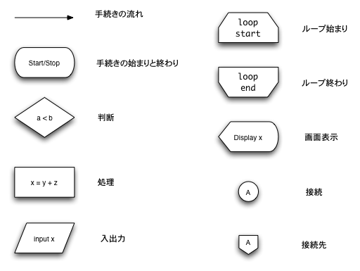

# フローチャート(流れ図)
  - *フローチャートとは、プログラムの流れを図解化するもの*
### なぜ、フローチャートを書くのか
* プログラミングをなれている人は、頭の中でプログラムの流れを頭の中で構成することができますが、初学者には、難しいためフローチャートを書きます。

### フローチャート描くメリット
1. プログラムの構造の整理がしやすい
2. プログラミングの速度が上がる
3. プログラムの品質改善に活かせる

### フローチャートには、3つの構造しかない
- 順次構造
  - 順次構造とは、上から順番に処理することです。
- 選択構造
  - 処理を選択させることです。
  - プログラムで言うと、if文に該当します。
- 反復構造
  - 同じ処理を繰り返すことです。
  - プログラムで言うと、while文とfor文に該当します。

### フローチャートで使う記号


### 演習
演習問題は、下記のサイトを利用して解答を作成してください。
* https://app.diagrams.net

1. 下記の配列のバブルソートで昇順で並び替えるフローチャートを作成してください。
```
配列
+--+--+--+--+
| 4| 1| 3| 2|
+--+--+--+--+
```
バブルソートについて、 https://medium-company.com/バブルソート/ を参照してください。
